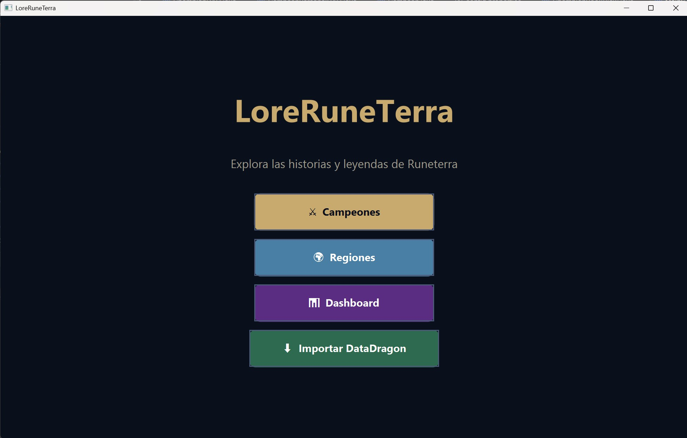
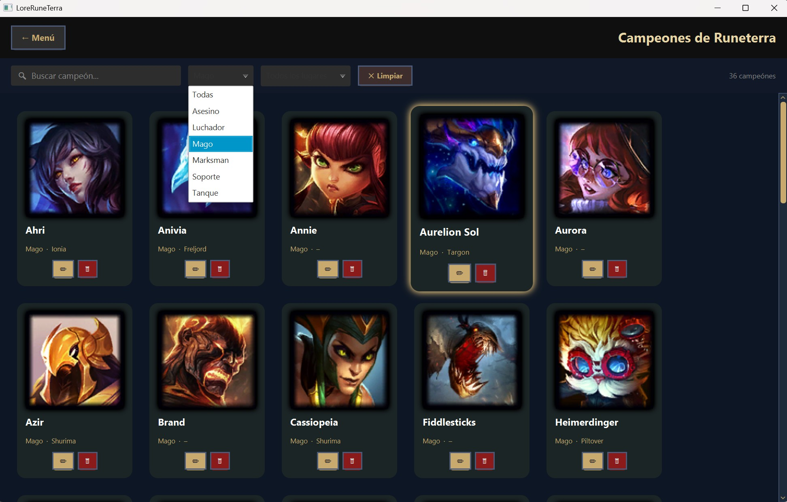
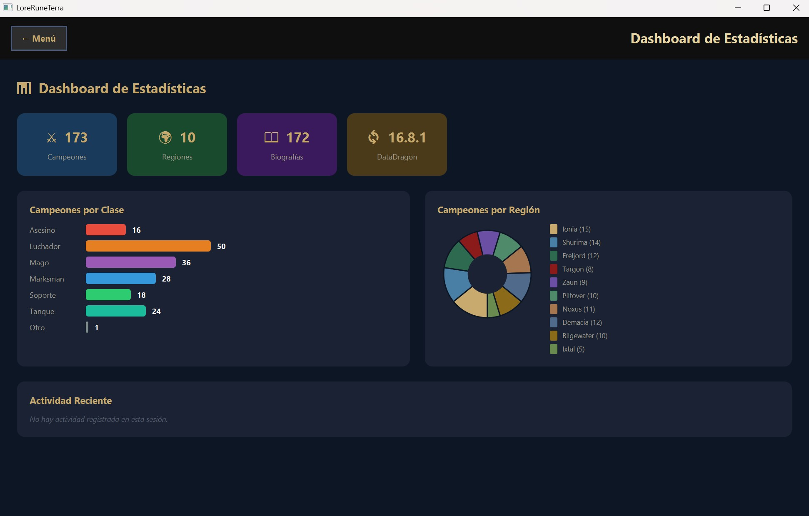
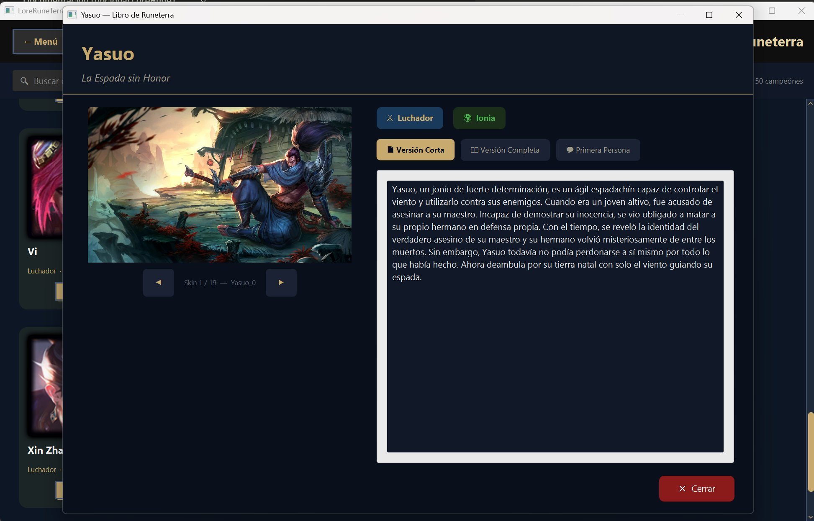

# LoreRuneTerra

**Aplicación de escritorio para la gestión del universo narrativo de League of Legends**

Trabajo de Fin de Ciclo — Desarrollo de Aplicaciones Multiplataforma (DAM)  
Autor: Francisco Andrés Manzo Cabrera | Curso 2025–2026

---

## ¿Qué es LoreRuneTerra?

LoreRuneTerra es una aplicación de escritorio Java que permite explorar, gestionar y personalizar el universo narrativo (lore) del videojuego League of Legends. Funciona **offline** con una base de datos PostgreSQL local, y permite sincronizar datos con la API pública DataDragon de Riot Games bajo demanda.

---

## Funcionalidades principales

- **Catálogo de campeones** — 172 campeones con imagen, clase y región. Filtros combinables por nombre, clase y región en tiempo real.
- **Libro del campeón** — Splashart HD con pasador de skins, badges de clase/región y 3 modalidades de biografía (corta, completa, primera persona).
- **CRUD completo** — Crear, editar y eliminar campeones y sus biografías con persistencia real en PostgreSQL.
- **Dashboard de estadísticas** — KPIs, gráfico de barras por clase y gráfico circular por región.
- **Vista de Regiones** — 10 regiones de Runeterra con imagen y descripción.
- **Importación DataDragon** — Sincronización con la API REST oficial de Riot Games con log en tiempo real.

---

## Tecnologías

| Tecnología | Versión | Uso |
|------------|---------|-----|
| Java | 23 | Lenguaje principal |
| JavaFX | 25.0.2 | Interfaz gráfica |
| PostgreSQL | 18 | Base de datos local |
| JDBC | 4.2 | Acceso a datos |
| Gson | 2.11.0 | Parseo JSON (DataDragon) |
| Maven | 3.9 | Gestión de dependencias |

---

## Arquitectura

El proyecto sigue el patrón **MVC + DAO**:

```
com.loreruneterra/
├── controller/     # MainController — navegación, CRUD, animaciones
├── db/             # ChampionDAO, CampeonPersonalDAO, PlacesDAO, DatabaseConnector
├── importer/       # DataDragonImporter — API REST Riot Games
├── model/          # Campeon, Lugar
├── view/           # ChampionBookView, DashboardView
└── MainApp.java    # Punto de entrada
```

---

## Requisitos

- Java 23+
- PostgreSQL 18+
- Maven 3.9+

---

## Configuración

1. Clona el repositorio:
```bash
git clone https://github.com/franzcelta/LoreRuneTerra.git
```

2. Crea la base de datos en PostgreSQL:
```sql
CREATE DATABASE loreruneterra;
```

3. Copia el fichero de configuración y edítalo con tus credenciales:
```bash
cp src/main/resources/config.properties.template src/main/resources/config.properties
```

```properties
db.host=localhost
db.port=5432
db.name=loreruneterra
db.user=tu_usuario
db.password=tu_contraseña
```

4. Ejecuta desde IntelliJ IDEA con la clase principal `com.loreruneterra.MainApp`.

---

## Capturas

| Menú principal | Catálogo con filtros |
|---|---|
|  |  |

| Dashboard | Libro del campeón |
|---|---|
|  |  |

---

## Licencia

Proyecto académico — uso educativo. Los datos de campeones pertenecen a Riot Games (DataDragon API).