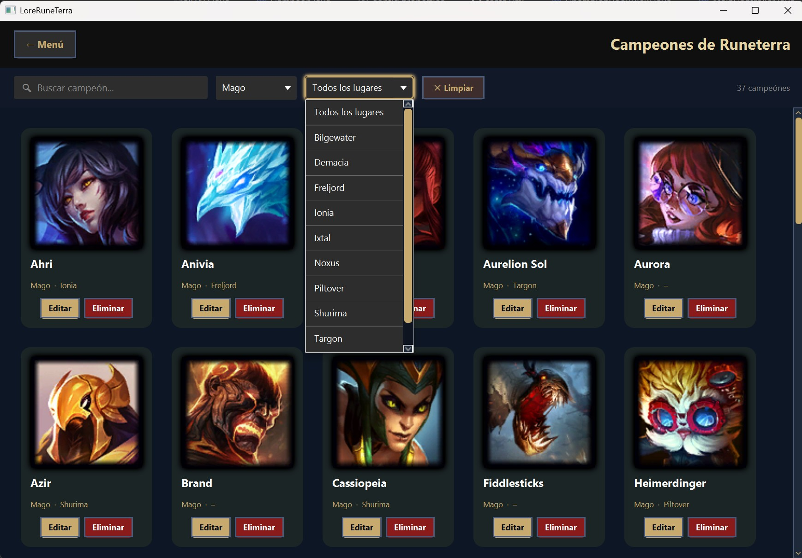
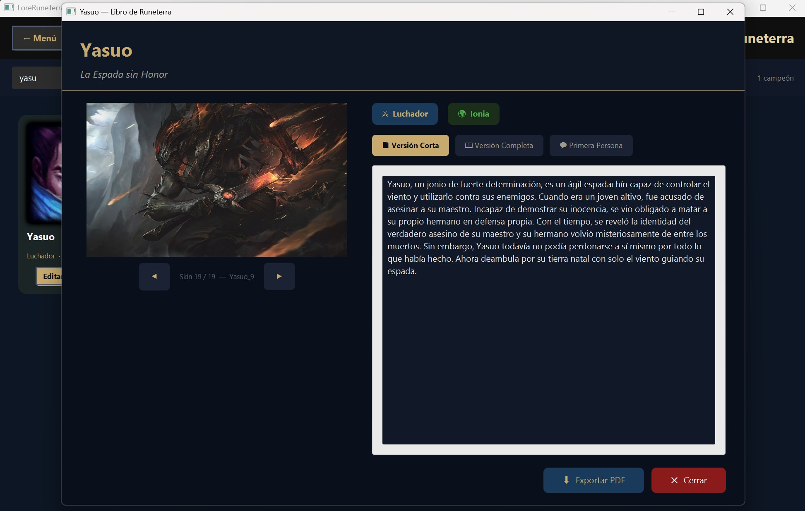
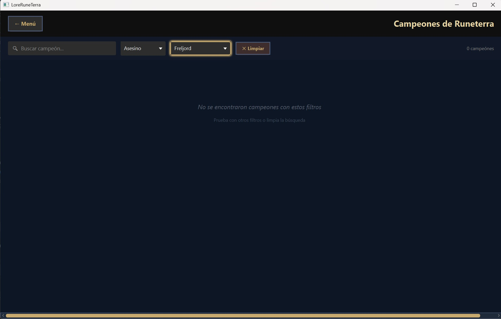
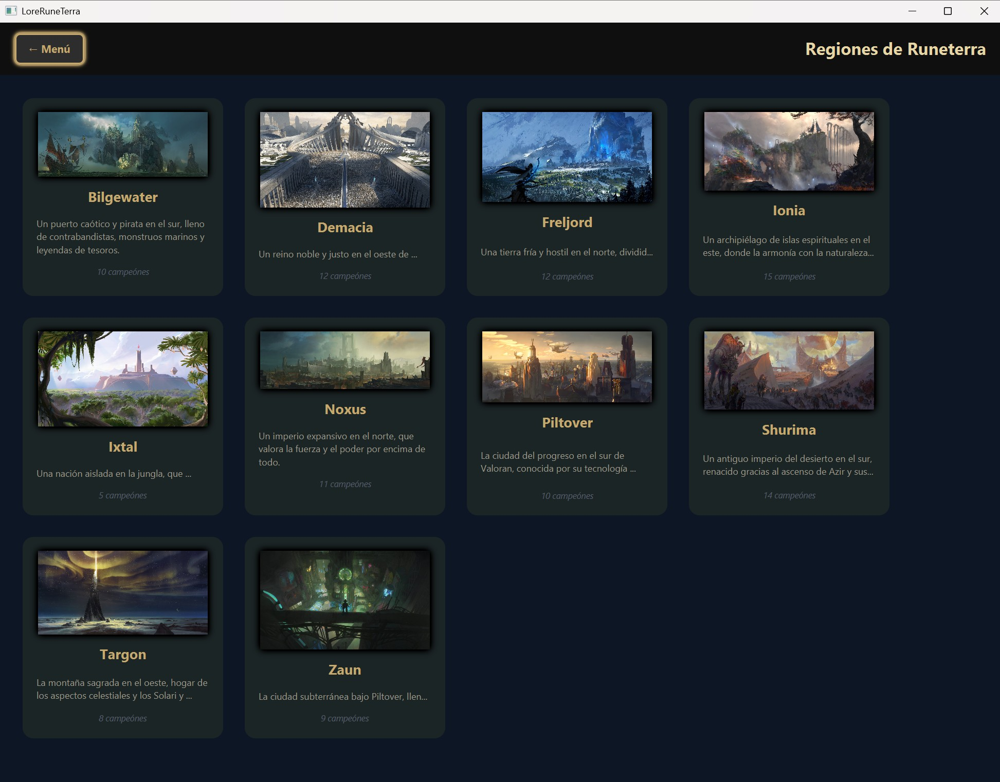
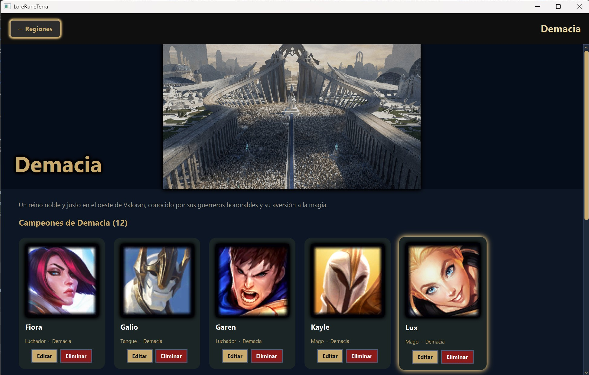
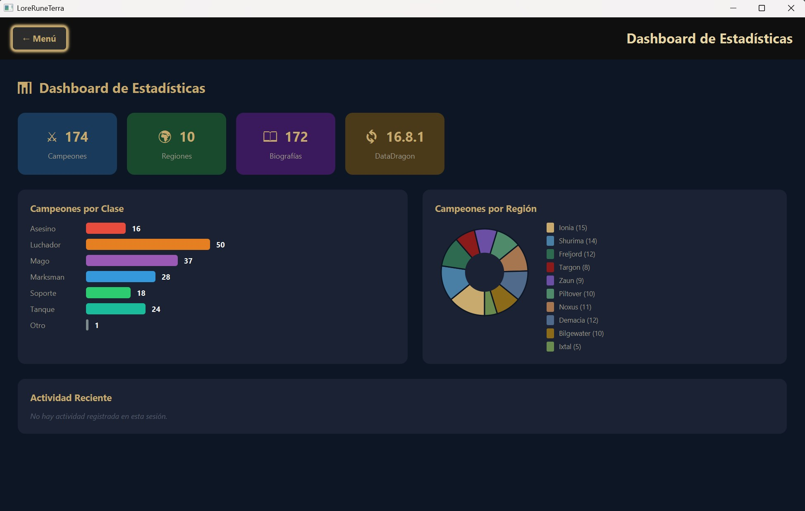
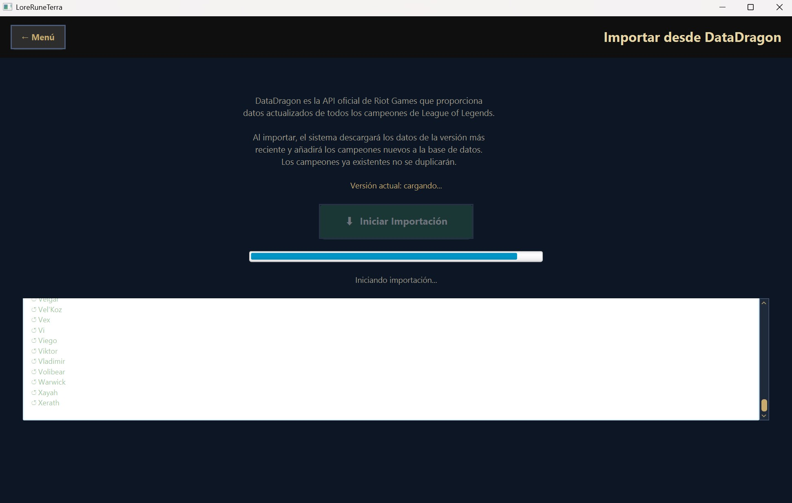

# LoreRuneTerra

**Aplicación de escritorio para la gestión del universo narrativo de League of Legends**


Trabajo de Fin de Ciclo — Desarrollo de Aplicaciones Multiplataforma (DAM)  
Autor: Francisco Andrés Manzo Cabrera | Curso 2024–2026

---

## Descargar

[](https://github.com/franzcelta/LoreRuneTerra/releases/tag/v1.0)

> **Requisitos:** Windows 10/11 + PostgreSQL 18 instalado y configurado.

---

## ¿Qué es LoreRuneTerra?

LoreRuneTerra es una aplicación de escritorio Java que permite explorar, gestionar y personalizar el universo narrativo (lore) del videojuego League of Legends. Funciona **offline** con una base de datos PostgreSQL local, y permite sincronizar datos con la API pública DataDragon de Riot Games bajo demanda.

---

## Funcionalidades principales

- **Catálogo de campeones** — 172 campeones con imagen, clase y región. Filtros combinables por nombre, clase y región en tiempo real.
- **Libro del campeón** — Splashart HD con pasador de skins, badges de clase/región y 3 modalidades de biografía (corta, completa, primera persona).
- **CRUD completo** — Crear, editar y eliminar campeones y sus biografías con persistencia real en PostgreSQL.
- **Dashboard de estadísticas** — KPIs, gráfico de barras por clase y gráfico circular por región implementado con Arc de JavaFX.
- **Vista de Regiones** — 10 regiones de Runeterra con imagen, descripción y vista de detalle con los campeones de cada región.
- **Importación DataDragon** — Sincronización con la API REST oficial de Riot Games con log en tiempo real y barra de progreso.
- **Exportación PDF** — Genera una ficha completa del campeón con imagen y biografía usando iText 7.
- **Tests de integración** — 23 tests con JUnit 5 que cubren los 3 DAOs principales, ejecutados automáticamente en cada push mediante GitHub Actions.

---

## Tecnologías

| Tecnología | Versión | Uso |
|------------|---------|-----|
| Java | 23 | Lenguaje principal |
| JavaFX | 25.0.2 | Interfaz gráfica |
| PostgreSQL | 18 | Base de datos local |
| JDBC | 4.2 | Acceso a datos |
| Gson | 2.11.0 | Parseo JSON (DataDragon) |
| Maven | 3.9 | Gestión de dependencias |
| iText 7 | 7.2.5 | Exportación de fichas en PDF |
| JUnit 5 | 5.10.2 | Tests de integración |

---

## Arquitectura

El proyecto sigue el patrón **MVC + DAO**:

    com.loreruneterra/
    ├── controller/     # MainController — navegación, CRUD, animaciones
    ├── db/             # ChampionDAO, CampeonPersonalDAO, PlacesDAO, DatabaseConnector
    ├── export/         # ChampionPDFExporter — exportación PDF con iText 7
    ├── importer/       # DataDragonImporter — API REST Riot Games
    ├── model/          # Campeon, Lugar
    ├── view/           # ChampionBookView, DashboardView, BiographyEditorDialog
    └── MainApp.java    # Punto de entrada

---

## Instalación y configuración

### Opción A — Instalador (recomendado)

1. Descarga `LoreRuneTerra-1.0.exe` desde [Releases](https://github.com/franzcelta/LoreRuneTerra/releases/tag/v1.0)
2. Ejecuta el instalador y sigue los pasos
3. Instala [PostgreSQL 18](https://www.postgresql.org/download/) si no lo tienes
4. Crea la base de datos y las tablas ejecutando el DDL de la sección inferior
5. Crea el archivo `config.properties` en `C:\Program Files\LoreRuneTerra\app\`:
```properties
db.host=localhost
db.port=5432
db.name=loreruneterra
db.user=tu_usuario
db.password=tu_contraseña
```
6. Abre la app y pulsa **Importar DataDragon** para cargar los 172 campeones

### Opción B — Desde código fuente

1. Clona el repositorio:
```bash
git clone https://github.com/franzcelta/LoreRuneTerra.git
```
2. Instala PostgreSQL 18 y crea la base de datos `loreruneterra`
3. Crea `src/main/resources/config.properties` con tus credenciales
4. Ejecuta el DDL de abajo para crear las tablas
5. Ejecuta desde IntelliJ IDEA con la clase principal `com.loreruneterra.MainApp`

---

## DDL — Crear tablas

```sql
CREATE TABLE IF NOT EXISTS lugares (
    id SERIAL PRIMARY KEY,
    nombre VARCHAR(100) NOT NULL UNIQUE,
    descripcion TEXT,
    imagen_url TEXT
);
CREATE TABLE IF NOT EXISTS campeones (
    id SERIAL PRIMARY KEY,
    key VARCHAR(60) NOT NULL UNIQUE,
    nombre VARCHAR(100) NOT NULL,
    titulo VARCHAR(200),
    clase VARCHAR(50),
    imagen TEXT,
    lugar_id INTEGER REFERENCES lugares(id) ON DELETE SET NULL,
    dificultad INTEGER
);
CREATE TABLE IF NOT EXISTS biografias (
    id SERIAL PRIMARY KEY,
    campeon_id INTEGER NOT NULL REFERENCES campeones(id) ON DELETE CASCADE,
    biografia_corta TEXT,
    biografia_completa TEXT,
    biografia_primera_persona TEXT,
    ultima_actualizacion DATE,
    UNIQUE(campeon_id)
);
CREATE TABLE IF NOT EXISTS campeones_personalizados (
    id SERIAL PRIMARY KEY,
    key VARCHAR(120) NOT NULL UNIQUE,
    nombre VARCHAR(100) NOT NULL,
    titulo VARCHAR(200),
    clase VARCHAR(50),
    imagen_icono TEXT,
    imagen_splash TEXT,
    bio_corta TEXT,
    bio_completa TEXT,
    bio_primera TEXT
);
```

---

## Capturas


| Menú principal | Catálogo con filtros |
|---|---|
|  |  |

| Libro de campeón y Exportar PDF | Sin resultados |
|---|---|
|  |  |

| Vista de Regiones | Detalle de Región |
|---|---|
|  |  |

| Dashboard | Importación DataDragon |
|---|---|
|  |  |
---

## Licencia

Proyecto académico — uso educativo. Los datos de campeones pertenecen a Riot Games (DataDragon API).